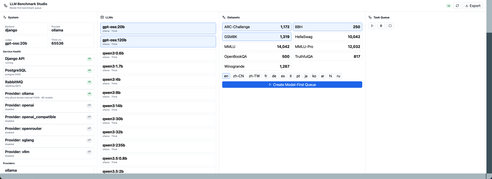
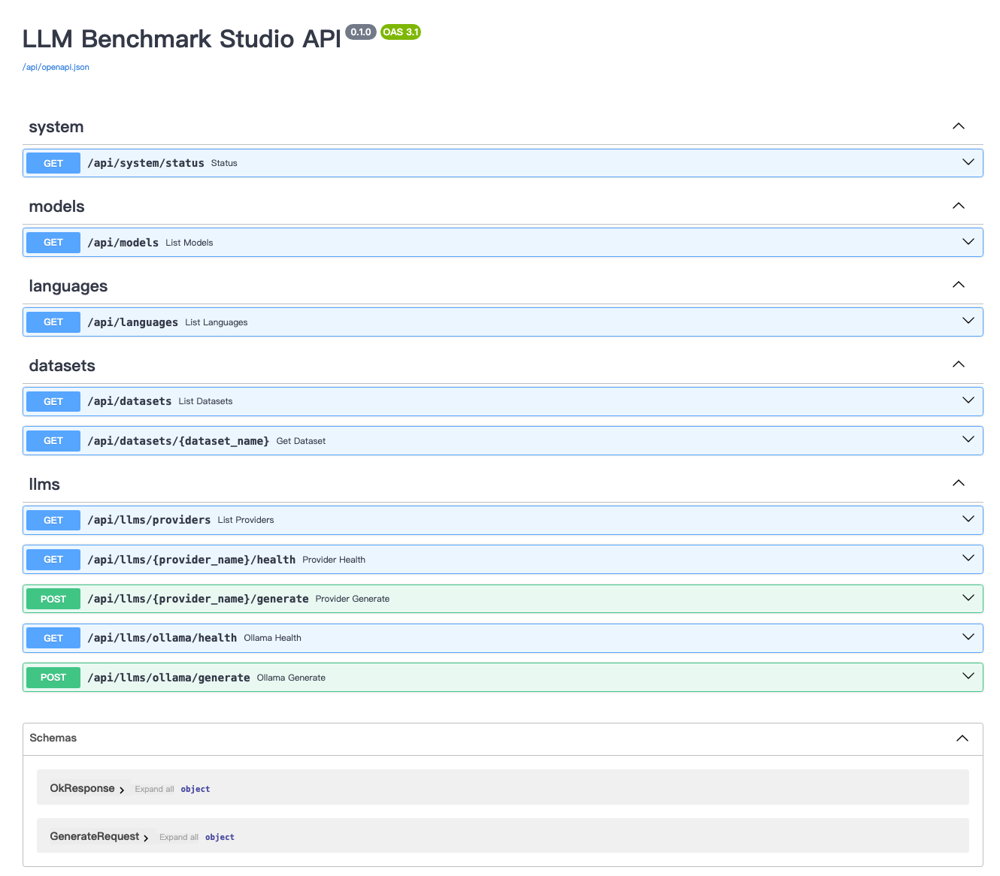
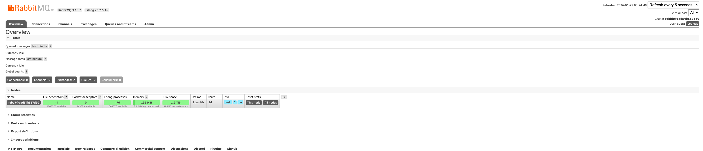

# LLM Benchmark Studio

LLM Benchmark Studio is a local-first benchmark system for running model evaluations with Django, Vue, PostgreSQL, RabbitMQ, and Celery.

Start here for the shortest runnable path:

```text
QUICKSTART.md
```

Default Django admin:

```text
http://localhost:6341/admin
username: guest
password: guest
```

Host-side system profiler FastAPI:

```text
http://127.0.0.1:6346/health
```



Architecture and flow diagrams:

```text
docs/mermaid-flows.md
```

Current planning documents live in:

```text
docs/prds/
```

## Data Layout

```text
data/
  download_default_datasets.py
  parse_all_datasets.py
  parser_json_rules.json
  languages.json
  llm_model_names.json
  benchmark_datasets/
    raw/
    *.json
```

`benchmark_datasets/raw/` stores raw JSONL exports downloaded through Hugging Face `datasets`.

`benchmark_datasets/*.json` stores normalized Studio JSON files that Django can import into PostgreSQL.

Large downloaded and normalized dataset files are ignored by git. Keep scripts, configs, and PRDs in git.

## Dataset Workflow

Install the dataset dependency in your Python environment:

```bash
pip install datasets
```

List supported default datasets:

```bash
python data/download_default_datasets.py --list
```

Download all default datasets:

```bash
python data/download_default_datasets.py
```

Download a small sample for smoke testing:

```bash
python data/download_default_datasets.py --limit 100
```

Download one dataset:

```bash
python data/download_default_datasets.py --dataset mmlu --limit 100
```

Parse raw data into normalized Studio JSON:

```bash
python data/parse_all_datasets.py
```

Overwrite existing normalized JSON:

```bash
python data/parse_all_datasets.py --force
```

## Recommended Usage

For a first run, use a small sample. This verifies the full download and parser pipeline without pulling every full benchmark dataset:

```bash
python data/download_default_datasets.py --limit 5
python data/parse_all_datasets.py --force
```

After that, inspect one normalized output:

```bash
python -m json.tool data/benchmark_datasets/mmlu.json
```

When the smoke test looks correct, download the full configured datasets:

```bash
python data/download_default_datasets.py --force
python data/parse_all_datasets.py --force
```

Download only one dataset:

```bash
python data/download_default_datasets.py --dataset mmlu --force
python data/parse_all_datasets.py --dataset mmlu --force
```

Show parser-supported dataset keys:

```bash
python data/parse_all_datasets.py --list
```

The parser rules live in:

```text
data/parser_json_rules.json
```

That file defines, per dataset:

- which raw field becomes the question stem
- which raw field becomes options
- which raw field becomes the gold answer
- which fields are kept as metadata
- which fields are intentionally ignored
- benchmark prompt
- judge prompt
- regex_judge rule
- expected answer format

The parser intentionally filters meaningless raw fields. The normalized JSON should contain only source metadata, explicit prompt rules, and question records needed for benchmark, judge, and regex_judge.

## Default Datasets

The default downloader is configured for broad benchmark coverage:

- MMLU
- MMLU-Pro
- ARC-Challenge
- HellaSwag
- TruthfulQA
- GSM8K
- BBH
- Winogrande
- OpenBookQA

Normalized files use this shape:

```json
{
  "source": {
    "dataset_name": "mmlu",
    "display_name": "MMLU",
    "subset": "all",
    "source_language": "en",
    "activate": true,
    "task_type": "multiple_choice",
    "answer_format": {
      "type": "single_option_letter",
      "valid_values": ["A", "B", "C", "D"]
    },
    "raw_source": {
      "type": "huggingface",
      "hf_path": "cais/mmlu",
      "hf_config": "all",
      "split": "test",
      "raw_path": "benchmark_datasets/raw/mmlu/test.jsonl"
    },
    "field_mapping": {},
    "metadata_keep_fields": ["subject"],
    "ignored_fields": [],
    "benchmark_prompt": "Return only the single correct option letter...",
    "judge_prompt": "Judge whether the model answer matches the gold answer...",
    "regex_judge_rule": {
      "purpose": "Run regex judge for an existing llm_response without overwriting llm_judge."
    }
  },
  "questions": [
    {
      "sample_id": "mmlu-00000001",
      "language": "en",
      "activate": true,
      "question": {
        "question_stem": "...",
        "options": {
          "A": "...",
          "B": "..."
        },
        "answer": "A"
      },
      "llm_response": {},
      "llm_judge": {},
      "regex_judge": [],
      "metadata": {}
    }
  ]
}
```

`llm_response`, `llm_judge`, and `regex_judge` are intentionally empty after parsing. They are filled later by the benchmark, judge, and regex_judge pipeline.

## Local Model Registry

`data/llm_model_names.json` lists local-runnable model names for the Studio. It includes models found through `ollama list` plus common Ollama local models. Pure cloud-only models are intentionally excluded.

Each model contains:

- `name`
- `provider`
- `family`
- `supports_think`
- `context_length`
- `activate`
- `installed`
- `metadata`

Large models such as `qwen3:235b` are listed but disabled by default.

## Languages

`data/languages.json` defines target languages for translation tasks. Each language has:

- `code`
- `name`
- `native_name`
- `activate`

When the source language equals the target language, translation should be skipped.

## Result Export

The Vue frontend must provide a one-click export action for all benchmark results.

Expected behavior:

- Frontend calls the backend export API.
- Backend packages all selected or all available result JSON files into a compressed ZIP.
- Browser downloads the ZIP.
- Exported JSON includes benchmark response, judge result, regex judge result, model metadata, dataset metadata, language, timestamps, and task metadata.

## Docker Compose

The benchmark stack runs in Docker, but the machine monitor runs as a separate host FastAPI service so it can sample the real host CPU, memory, disk, network, and best-effort GPU metrics.

Start the Docker stack:

```bash
docker compose up --build -d worker backend rabbitmq postgres frontend
```

Then start the host system profiler:

```bash
PYTHONPATH=backend python3 -m uvicorn system_profiler.api:app --host 127.0.0.1 --port 6346
```

The frontend reads profiler data directly from Vue, without proxying or re-checking it through Django:

```text
http://127.0.0.1:6346
```

`docker-compose.yml` starts PostgreSQL, RabbitMQ, the Django backend, and the Vue frontend by default. PostgreSQL listens on `5432` inside Docker and is exposed to the host as `localhost:55432`, so it does not conflict with an existing local `5432`.

```env
POSTGRES_HOST=postgres
POSTGRES_PORT=5432
POSTGRES_HOST_PORT=55432
```

Start the normal local stack:

```bash
docker compose up --build
```

## Logs

All service logs are written to the project-local directory:

```text
logs/
```

Naming convention:

```text
YYYYMMDD-HHMMSS-backend.log
YYYYMMDD-HHMMSS-worker.log
YYYYMMDD-HHMMSS-frontend.log
YYYYMMDD-HHMMSS-postgres.log
YYYYMMDD-HHMMSS-rabbitmq.log
YYYYMMDD-HHMMSS-rabbitmq-sasl.log
YYYYMMDD-HHMMSS-llm_walltime.log
```

`llm_walltime` is reserved for model execution timing records. Each line records provider, model, task kind, dataset, language, start time, finish time, elapsed seconds, and walltime seconds.

Run it in the background:

```bash
docker compose up --build -d
```

Open:

```text
Frontend: http://localhost:6325
Backend:  http://localhost:6341/api/system/status
Swagger:  http://localhost:6341/api/docs
OpenAPI:  http://localhost:6341/api/openapi.json
RabbitMQ: http://localhost:15672
```





The browser calls API paths through the frontend origin, for example `http://localhost:6325/api/system/status`. Vite proxies `/api` to `http://backend:8000` inside the Docker network.

The backend container runs database migrations automatically on startup. To run migrations manually:

```bash
docker compose exec backend python manage.py migrate
```

PostgreSQL data is persisted inside the current project directory:

```text
.docker/postgres/data/
```

This directory is ignored by git. `docker compose down` keeps the database data. To clear PostgreSQL completely, stop compose first, then delete `.docker/postgres/data/`.

To use a manually started host PostgreSQL instead of compose PostgreSQL, set:

```env
POSTGRES_HOST=host.docker.internal
POSTGRES_PORT=5432
```

Stop services:

```bash
docker compose down
```

If Compose reports an old PostgreSQL orphan container, for example `llm-benchmark-studio-postgres-1`, clean it up:

```bash
docker compose down --remove-orphans
```

## Port Cleanup

Check what is listening on a port, for example `6325`:

```bash
lsof -nP -iTCP:6325 -sTCP:LISTEN
```

Release the port directly:

```bash
kill $(lsof -tiTCP:6325 -sTCP:LISTEN)
```

Force kill only if the normal signal does not stop it:

```bash
kill -9 $(lsof -tiTCP:6325 -sTCP:LISTEN)
```

For another port, replace `6325` with the target port:

```bash
kill $(lsof -tiTCP:8000 -sTCP:LISTEN)
```

If Docker owns the port, stop the container instead:

```bash
docker ps --format '{{.ID}} {{.Names}} {{.Ports}}'
docker stop container-name
```
