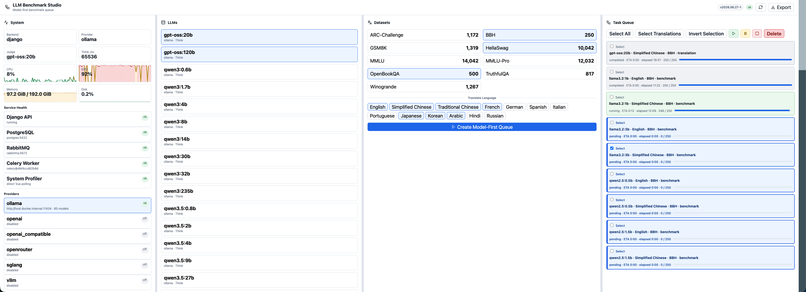

# LLM Benchmark Studio 使用说明

LLM Benchmark Studio 是一个本地优先的 LLM 测评系统，规划由五部分组成：

## 技术栈

- 后端：Django 5、Django Ninja、Server-Sent Events（SSE）
- 任务队列：Celery、RabbitMQ
- 数据库：PostgreSQL
- 前端：Vue 3、Vite、Pinia
- 包管理：pnpm
- 系统监控：宿主机侧 FastAPI system profiler
- 容器编排：Docker、Docker Compose
- LLM Provider：Ollama、OpenAI、OpenRouter、vLLM、SGLang、OpenAI-compatible APIs

最短可运行路径先看：

```text
QUICKSTART_CN.md
```

默认 Django admin：

```text
http://localhost:6341/admin
用户名: guest
密码: guest
```

宿主机侧 system profiler FastAPI：

```text
http://127.0.0.1:6346/health
```



中文架构和流程图：

```text
docs/mermaid-flows-cn.md
```

- Django：只负责 API、SSE、配置读取、结果查询和任务入口。
- Vue：前端 Studio，默认按 21:9 屏幕设计。
- PostgreSQL：保存数据集、模型输出、LLM judge、regex judge、任务状态和导出结果。
- RabbitMQ：Celery 消息队列。
- Celery：执行下载、导入、测评、judge、翻译等长任务。

当前后端默认端口是：

```text
6341
```

当前前端默认端口是：

```text
6325
```

## 目录结构

```text
backend/                 Django 后端
data/                    数据、模型列表、语言列表、下载和解析脚本
docs/prds/               PRD 和 JSON 格式设计文档
docker-compose.yml       PostgreSQL、RabbitMQ、Django backend、Vue frontend 编排
Dockerfile               Django backend 镜像
requirements.txt         Python 依赖
pyproject.toml           Python 项目和测试配置
```

## Docker Compose 启动

首次运行先复制环境变量模板：

```bash
cp .env.example .env
```

然后按本机情况修改 `.env`。`.env` 里可能包含数据库密码和 API key，不要提交到 git。

`docker-compose.yml` 默认启动 PostgreSQL、RabbitMQ、Django backend 和 Vue frontend。PostgreSQL 容器内部端口是 `5432`，宿主机访问端口默认是 `55432`，不会抢占你本机已有的 `5432`。

```env
POSTGRES_HOST=postgres
POSTGRES_PORT=5432
POSTGRES_HOST_PORT=55432
```

测评主栈跑在 Docker 里，但系统监控不放进 Docker。`backend/system_profiler` 现在作为一个单独的宿主机 FastAPI 服务启动，这样前端才能直接读取更接近真实机器的 CPU、内存、磁盘、网络和尽力而为的 GPU 指标；Django 不会代理或二次检查它。

先在项目根目录运行：

```bash
docker compose up --build
```

后台运行：

```bash
docker compose up --build -d
```

然后在宿主机启动 system profiler：

```bash
PYTHONPATH=backend python3 -m uvicorn system_profiler.api:app --host 127.0.0.1 --port 6346
```

启动后访问：

```text
前端: http://localhost:6325
后端: http://localhost:6341/api/system/status
Swagger: http://localhost:6341/api/docs
OpenAPI JSON: http://localhost:6341/api/openapi.json
System profiler: http://127.0.0.1:6346/health
```


backend 容器启动时会自动执行数据库迁移。如果需要手动重新执行迁移：

```bash
docker compose exec backend python manage.py migrate
```

RabbitMQ 管理页面：

```text
http://localhost:15672
```


默认账号密码来自 `.env` 或 compose 默认值：

```text
guest / guest
```

PostgreSQL 数据默认持久化在当前项目目录：

```text
.docker/postgres/data/
```

这个目录已加入 `.gitignore`。`docker compose down` 会保留数据库数据；如果需要彻底清空 PostgreSQL，先停止 compose，再手动删除 `.docker/postgres/data/`。

日志默认保存到当前项目目录：

```text
logs/
```

命名规则：

```text
YYYYMMDD-HHMMSS-backend.log
YYYYMMDD-HHMMSS-worker.log
YYYYMMDD-HHMMSS-frontend.log
YYYYMMDD-HHMMSS-postgres.log
YYYYMMDD-HHMMSS-rabbitmq.log
YYYYMMDD-HHMMSS-rabbitmq-sasl.log
YYYYMMDD-HHMMSS-llm_walltime.log
```

其中 `llm_walltime` 是模型真实运行耗时日志，单行记录 provider、model、任务类型、数据集、语言、开始时间、结束时间、elapsed seconds 和 walltime seconds。

如果不用 compose PostgreSQL，而是连接你手动启动的本机 PostgreSQL，把 `.env` 改成：

```env
POSTGRES_HOST=host.docker.internal
POSTGRES_PORT=5432
```

## Docker Compose 停止

停止服务但保留数据卷：

```bash
docker compose down
```

如果 compose 提示旧 PostgreSQL orphan 容器，例如 `llm-benchmark-studio-postgres-1`，清理旧容器：

```bash
docker compose down --remove-orphans
```

停止服务并删除 PostgreSQL / RabbitMQ 数据卷：

```bash
docker compose down -v
```

查看日志：

```bash
docker compose logs -f backend
docker compose logs -f frontend
docker compose logs -f postgres
docker compose logs -f rabbitmq
```

只重启后端：

```bash
docker compose restart backend
```

## 端口占用处理

如果某个端口被旧进程占用，比如 `6325`：

```bash
lsof -nP -iTCP:6325 -sTCP:LISTEN
```

直接按端口释放：

```bash
kill $(lsof -tiTCP:6325 -sTCP:LISTEN)
```

如果普通 `kill` 没停掉，再强制释放：

```bash
kill -9 $(lsof -tiTCP:6325 -sTCP:LISTEN)
```

如果要释放 `8000`，把命令里的 `6325` 换成 `8000`：

```bash
kill $(lsof -tiTCP:8000 -sTCP:LISTEN)
```

如果端口是 Docker 容器占用，先查容器：

```bash
docker ps --format '{{.ID}} {{.Names}} {{.Ports}}'
```

然后停止对应容器：

```bash
docker stop 容器名
```

## 本地运行 Django

安装依赖：

```bash
pip install -r requirements.txt
```

启动后端：

```bash
cd backend
python manage.py runserver 6341
```

访问：

```text
http://localhost:6341/api/system/status
```

## 本地运行 Vue

前端使用 pnpm，不使用 npm。

安装依赖：

```bash
pnpm install
```

启动前端：

```bash
pnpm --dir frontend dev
```

前端默认地址：

```text
http://localhost:6325
```

前端会通过 Vite proxy 调用 Django：

```text
浏览器 -> http://localhost:6325/api
Vite proxy -> http://backend:8000/api
```

运行前端测试：

```bash
pnpm --dir frontend test
```

构建前端：

```bash
pnpm --dir frontend build
```

## 运行测试

在项目根目录运行：

```bash
python3 backend/manage.py test tests -v 2
```

当前测试覆盖：

- system API
- models API
- languages API
- datasets API
- dataset JSON 结构
- path traversal 防护
- Ollama client mock 测试

## Benchmark 任务队列顺序

测评任务默认按模型分组：

```text
模型 A -> 跑完所有选定数据集/样本
模型 B -> 跑完所有选定数据集/样本
模型 C -> 跑完所有选定数据集/样本
```

不要默认按数据集交错模型：

```text
数据集 1: 模型 A, 模型 B, 模型 C
数据集 2: 模型 A, 模型 B, 模型 C
```

原因是本地模型加载成本很高。如果模型在 HDD 上，反复 unload/load 会非常慢。按模型连续跑可以减少加载次数，也更适合 Ollama、vLLM、SGLang 和本地 Transformers/LoRA 服务。

Vue 的 Task Queue 也必须按这个顺序展示：

```text
run_group_id -> model_group_order -> dataset_order -> sample_order
```

也就是说，前端看到的队列顺序和后端/Celery 实际执行顺序一致，不能因为按创建时间或数据集分组导致不同模型交错。

## 下载默认数据集

先安装依赖：

```bash
pip install datasets
```

全量下载默认数据集：

```bash
python3 data/download_default_datasets.py --force
```

只下载小样本用于测试：

```bash
python3 data/download_default_datasets.py --limit 5 --force
```

只下载一个数据集：

```bash
python3 data/download_default_datasets.py --dataset mmlu --force
```

## 解析数据集

把 raw JSONL 解析成 Studio 统一 JSON：

```bash
python3 data/parse_all_datasets.py --force
```

输出目录：

```text
data/benchmark_datasets/
```

每个问题包含：

```json
{
  "question": {
    "question_stem": "...",
    "options": {},
    "answer": "..."
  },
  "llm_response": {},
  "llm_judge": {},
  "regex_judge": []
}
```

解析规则文件：

```text
data/parser_json_rules.json
```

## Ollama

后端默认连接：

```text
http://127.0.0.1:11434
```

Docker 中默认使用：

```text
http://host.docker.internal:11434
```

检查本机 Ollama：

```bash
ollama list
```

当前默认 judge / translate 模型规划为：

```text
gpt-oss:20b
```

Ollama 是一个 provider，可以通过 `.env` 的 `DEFAULT_PROVIDER`、`JUDGE_PROVIDER`、`TRANSLATE_PROVIDER` 切换。

Provider 名称：

```text
ollama
openai
openrouter
vllm
sglang
openai_compatible
```

`vllm`、`sglang` 和 `openai_compatible` 都遵守 OpenAI-compatible API：

```text
GET  {BASE_URL}/models
POST {BASE_URL}/chat/completions
```

默认端口：

```text
vLLM: 8000
SGLang: 30000
local-transformers-openai-api: 6328
```

例如你自己用 FastAPI 起了一个 transformers 服务，只要它兼容 OpenAI `/v1/chat/completions`，就配置：

```env
DEFAULT_PROVIDER=openai_compatible
OPENAI_COMPATIBLE_ENABLED=true
OPENAI_COMPATIBLE_BASE_URL=http://127.0.0.1:6328/v1
OPENAI_COMPATIBLE_API_KEY=
```

本项目提供了一个最小本地服务示例：

```text
local-transformers-openai-api/
```

这个本地 Transformers/LoRA 服务不由 `docker compose` 自动安装。`torch`、Transformers、PEFT 需要手动装，避免 macOS 或 CPU-only 机器误下载 CUDA 包。

先执行：

```bash
pip install -r local-transformers-openai-api/requirements.txt
python local-transformers-openai-api/check_environment.py
```

然后按检测结果安装 `torch`。

这个服务支持一个 registry 里配置多个 base model / LoRA adapter，但每个进程一次只 load 一个模型，避免显存被多个模型同时占满：

```bash
python local-transformers-openai-api/openai_api_server.py \
  --registry local-transformers-openai-api/model_registry.example.json \
  --model-id qwen2_5_7b_lora_math \
  --host 127.0.0.1 \
  --port 6328
```

注意：部分 thinking 模型可能返回 `thinking` 字段。后端 provider 层只返回最终答案和 `thinking_present`，不返回 thinking 文本。

## 常用 API

```text
GET  /api/docs
GET  /api/openapi.json
GET  /api/system/status
GET  /api/models
GET  /api/languages
GET  /api/datasets
GET  /api/datasets/{dataset_name}
GET  /api/llms/ollama/health
POST /api/llms/ollama/generate
GET  /api/llms/providers
GET  /api/llms/{provider_name}/health
POST /api/llms/{provider_name}/generate
```

## 清理说明

大型数据文件被 `.gitignore` 忽略：

```text
data/benchmark_datasets/raw/*
data/benchmark_datasets/*.json
```

如果需要重新生成数据：

```bash
python3 data/download_default_datasets.py --force
python3 data/parse_all_datasets.py --force
```
