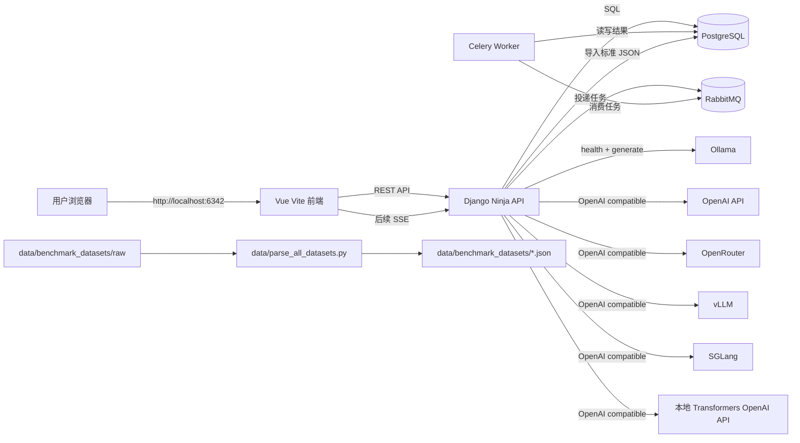
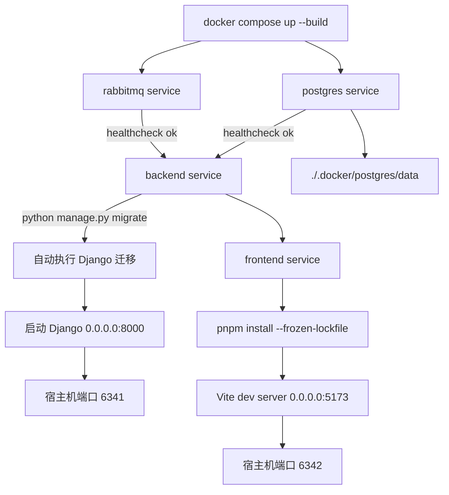
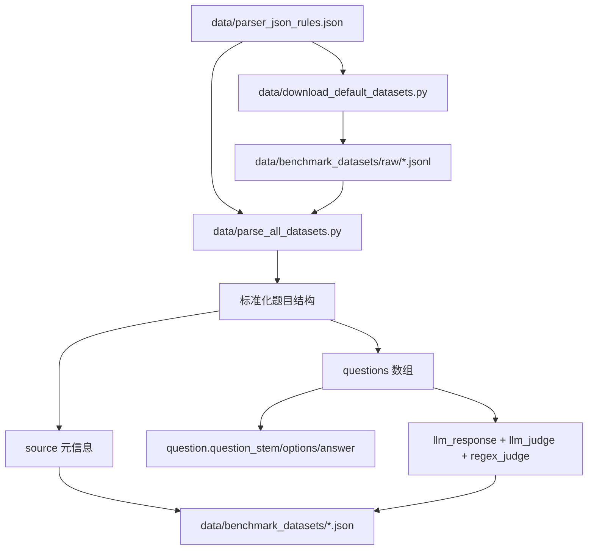
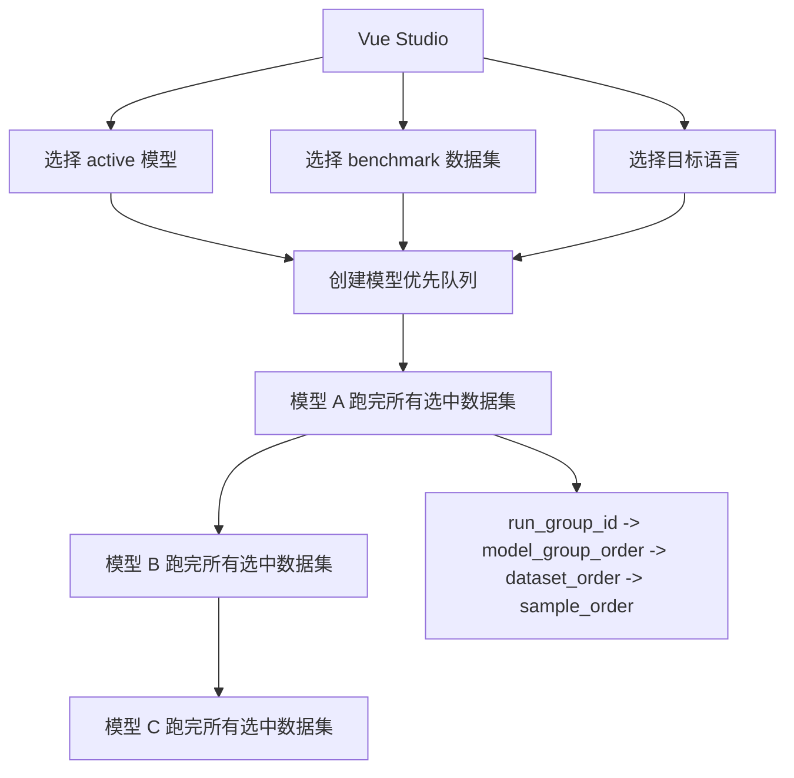
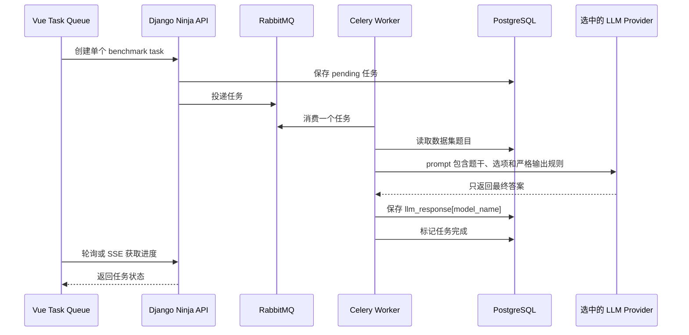
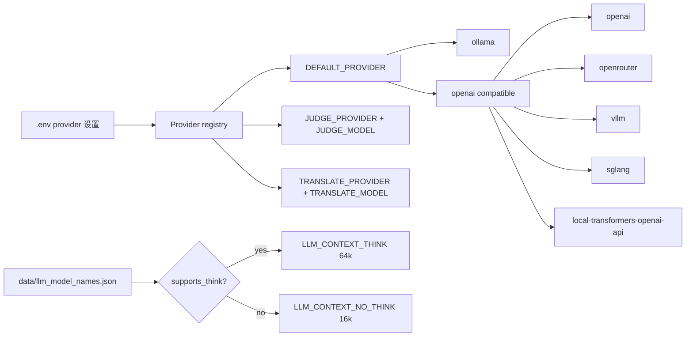
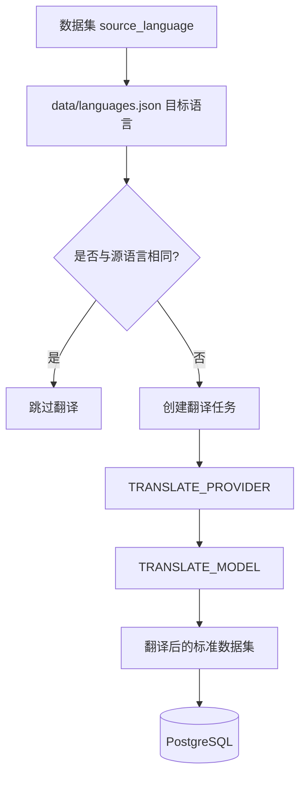
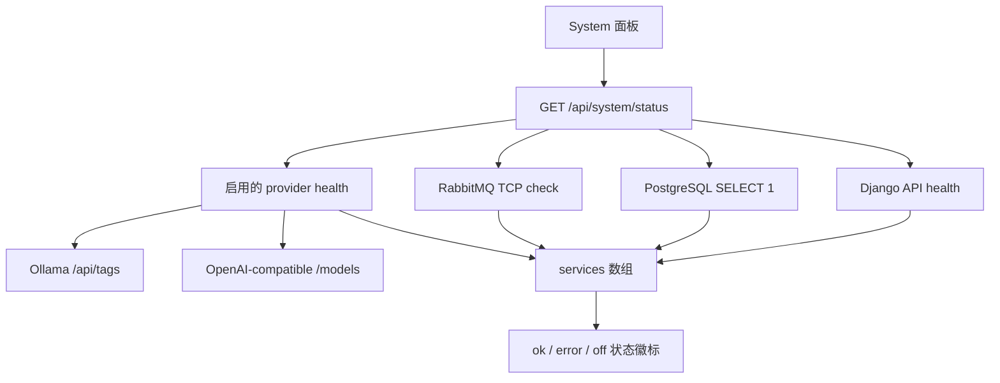
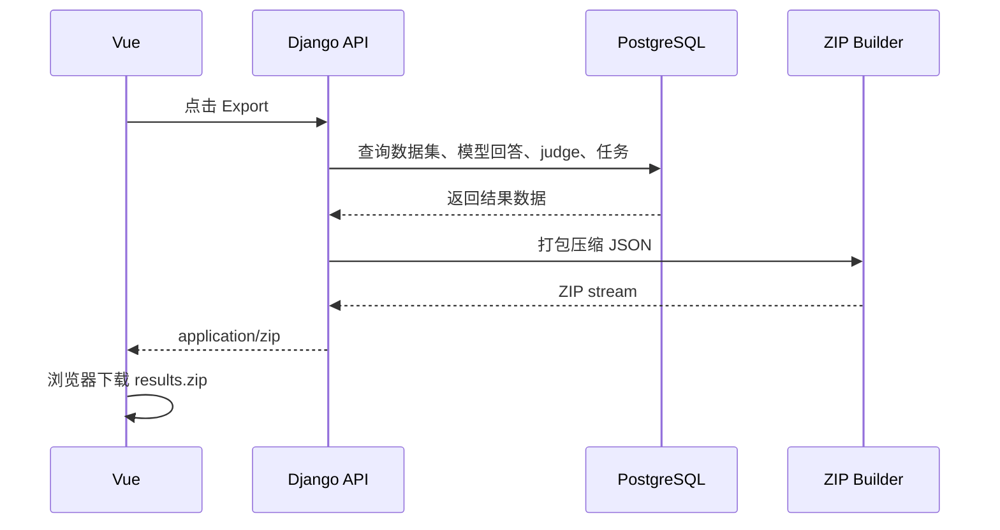
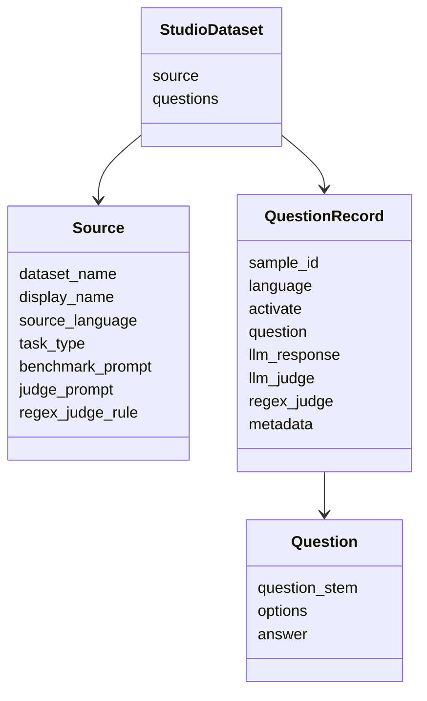

# LLM Benchmark Studio Mermaid 流程图

本文档用 Mermaid 展示 LLM Benchmark Studio 的主要产品流程和运行流程。

## 系统架构



## Docker Compose 启动流程



## 数据集下载与解析



## Benchmark 队列创建



## 单个测评任务



## LLM Provider 选择



## LLM Judge 与 Regex Judge

```mermaid
flowchart TD
  Question[题干 + 选项 + 标准答案] --> JudgeContext[Judge prompt 上下文]
  Response[llm_response[model_name]] --> JudgeContext
  JudgeModel[JUDGE_MODEL] --> LLMJudge[LLM judge]
  JudgeContext --> LLMJudge
  LLMJudge --> SaveJudge[保存 llm_judge[model_name]]

  Response --> RegexRule[regex_judge_rule]
  RegexRule --> RegexJudge[Regex judge]
  RegexJudge --> SaveRegex[保存 regex_judge[model_name]]

  SaveJudge --> DB[(PostgreSQL)]
  SaveRegex --> DB
```

## 翻译流程



## System Health 面板



## 结果导出



## 标准 JSON 结构


