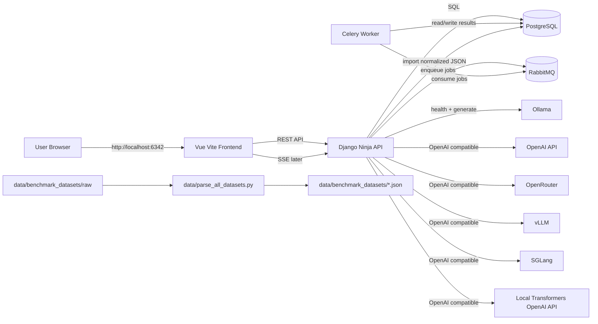
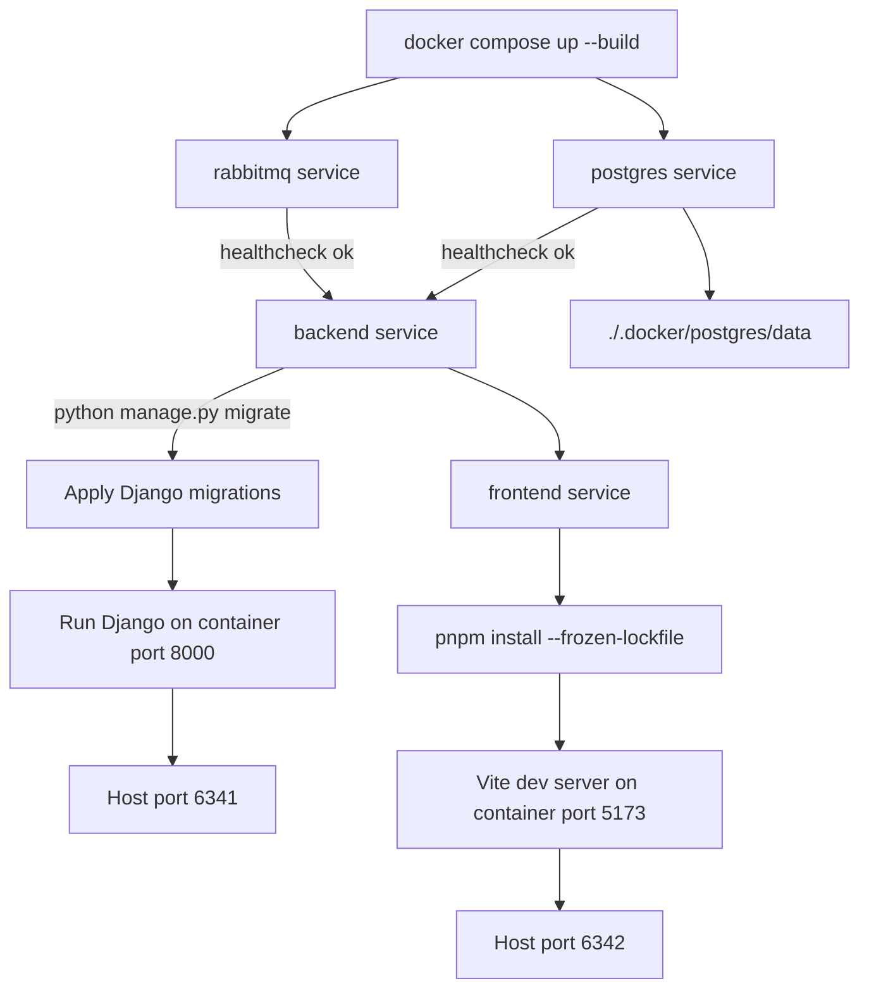
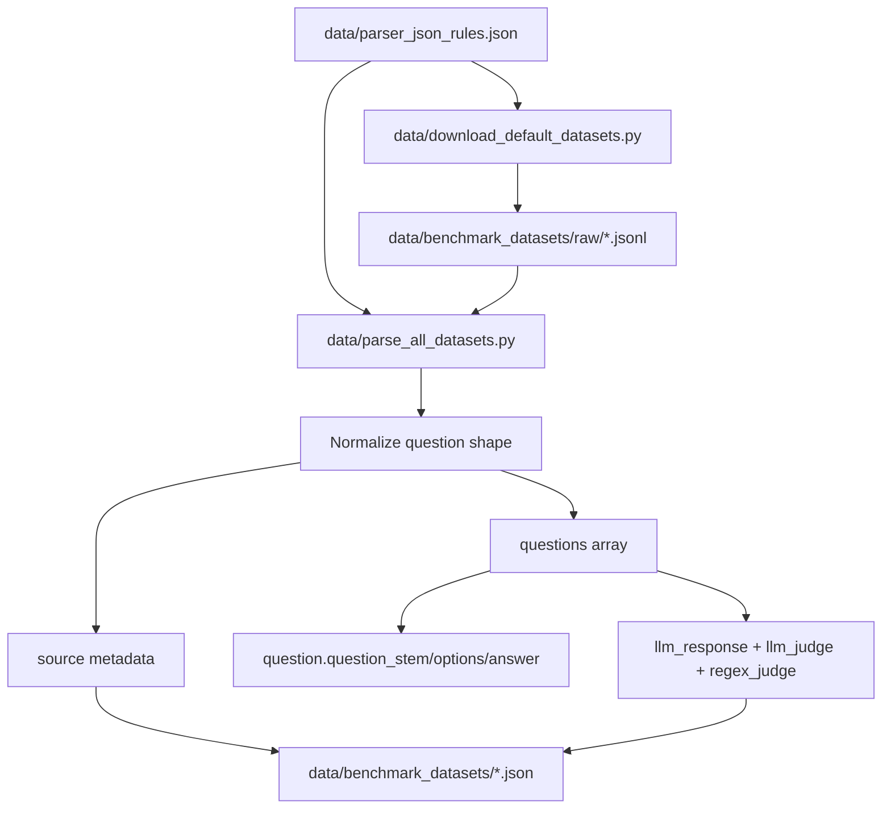
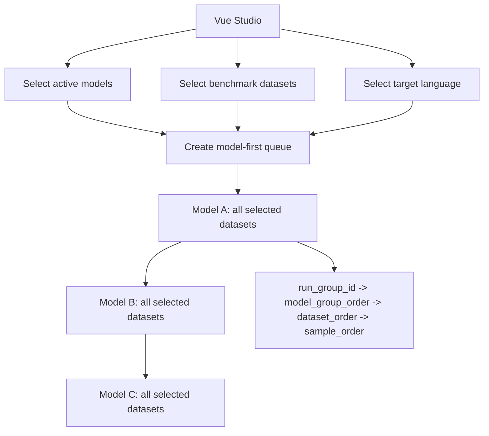
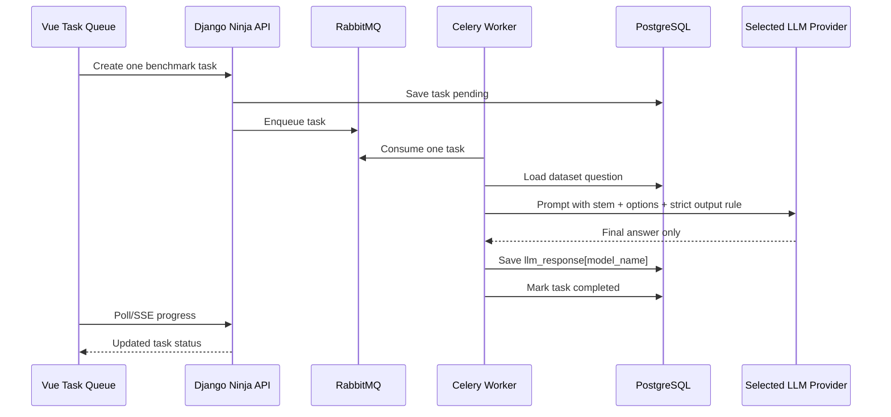
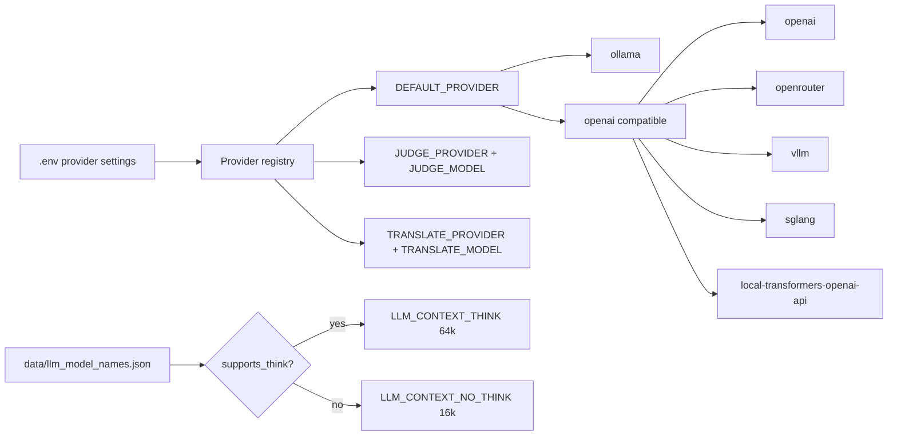
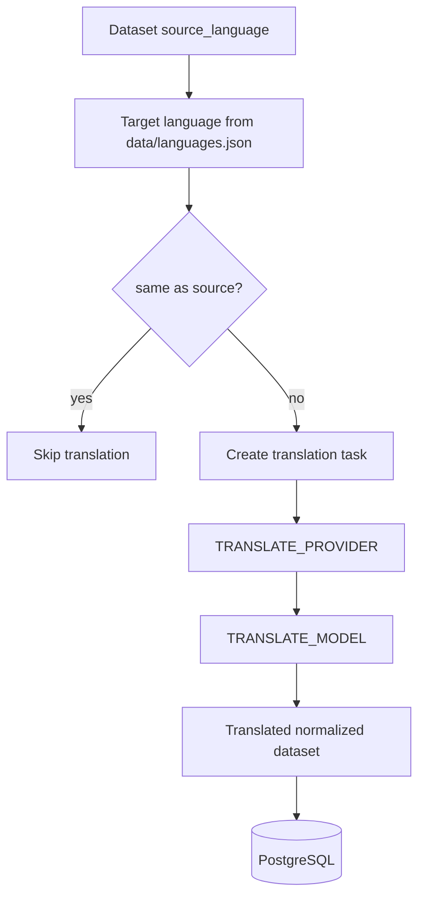
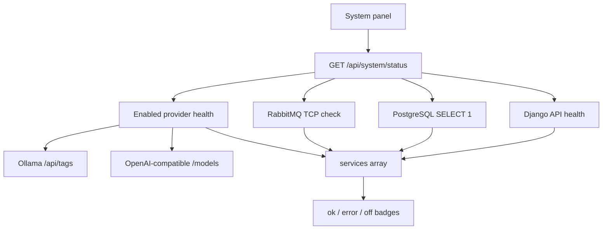
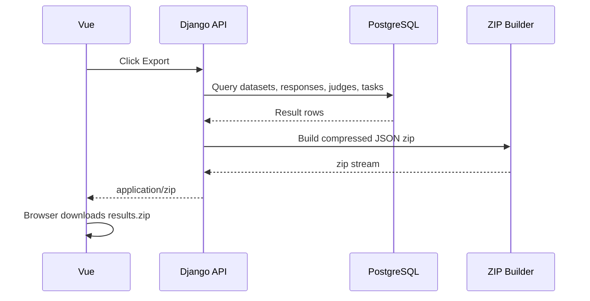
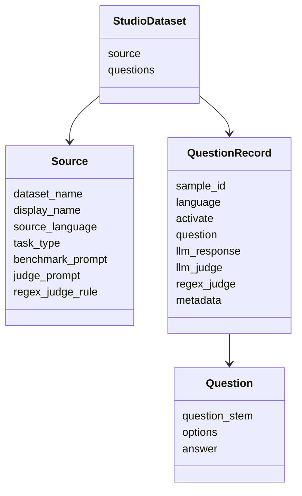

# LLM Benchmark Studio Mermaid Flows

This document shows the main product and runtime flows for LLM Benchmark Studio.

## System Architecture



## Docker Compose Startup



## Dataset Download And Parse



## Benchmark Queue Creation



## Single Benchmark Task



## LLM Provider Selection



## Judge And Regex Judge

```mermaid
flowchart TD
  Question[question stem + options + gold answer] --> JudgeContext[Judge prompt context]
  Response[llm_response[model_name]] --> JudgeContext
  JudgeModel[JUDGE_MODEL] --> LLMJudge[LLM judge]
  JudgeContext --> LLMJudge
  LLMJudge --> SaveJudge[Save llm_judge[model_name]]

  Response --> RegexRule[regex_judge_rule]
  RegexRule --> RegexJudge[Regex judge]
  RegexJudge --> SaveRegex[Save regex_judge[model_name]]

  SaveJudge --> DB[(PostgreSQL)]
  SaveRegex --> DB
```

## Translation Flow



## System Health Panel



## Result Export



## Normalized JSON Shape


